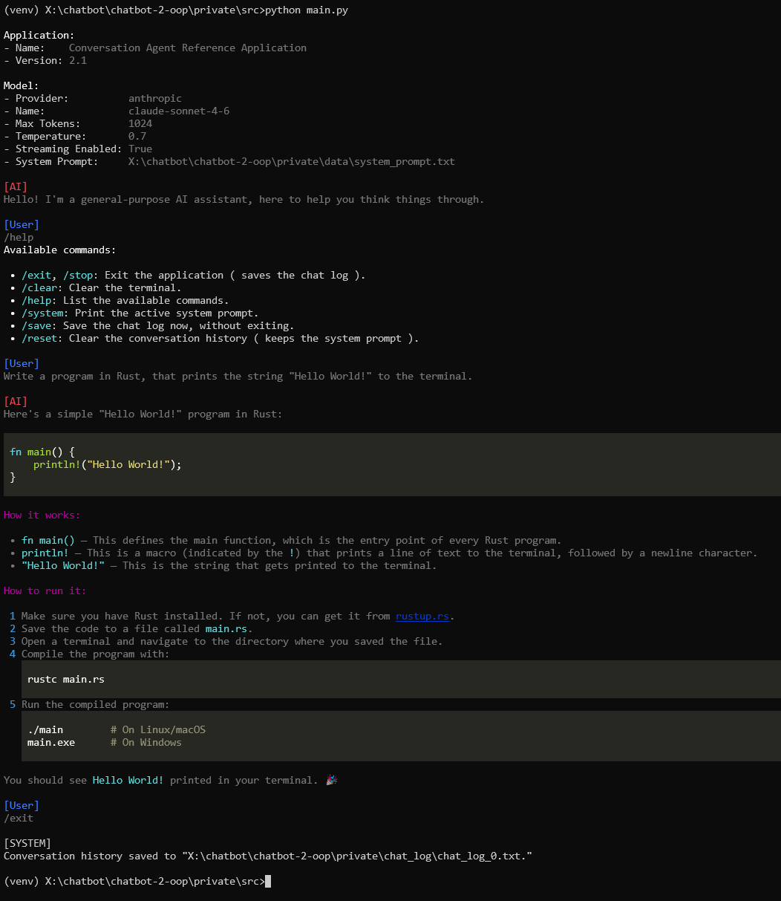
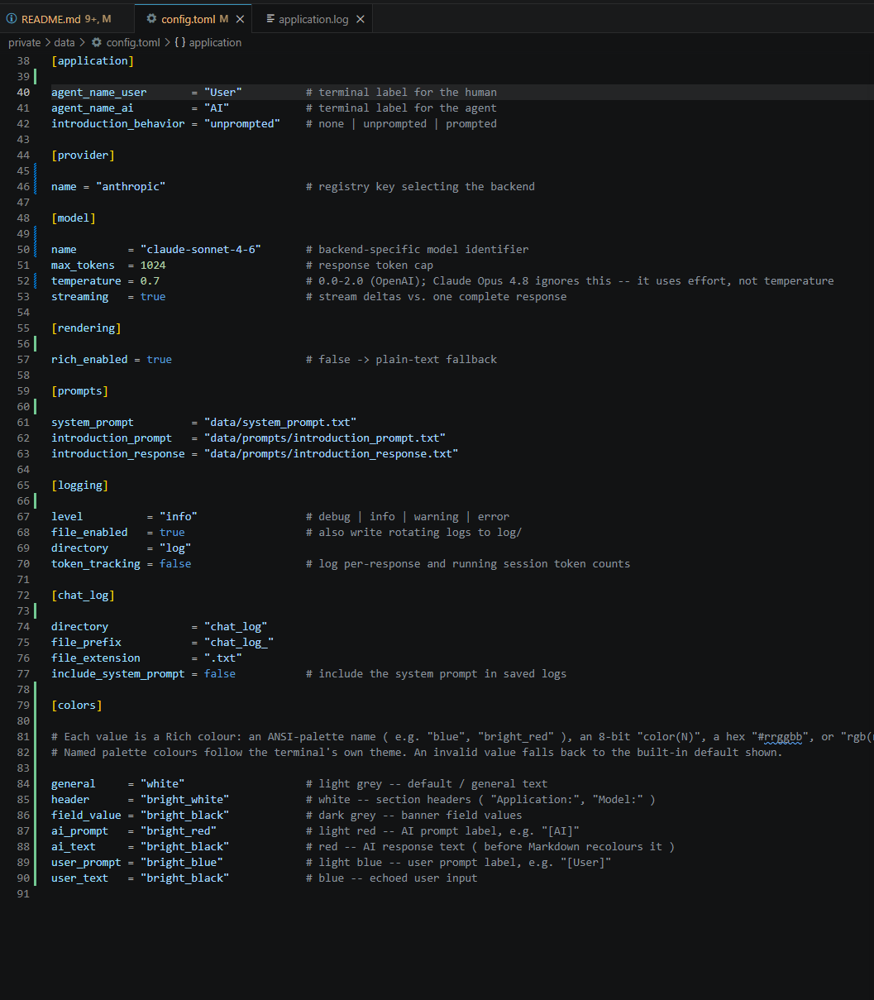

# Service Provider Agnostic LLM Chatbot
**Reference Application** - **Version:** 2.1


<p align="center">
  
  &nbsp;
  
</p>

A general-purpose, service-provider agnostic, terminal-based LLM chat agent. Intended as a clean, object-oriented starting point for building LLM chatbot applications. It demonstrates a turn-based conversation loop with history, Markdown rendering, a small command system, swappable backends, external configuration, and diagnostic logging.

## 📖 Table of Contents

1. [✨ Features](#1--features)
2. [🏛️ Architecture](#2-️-architecture)
3. [🛠️ Installation](#3-️-installation)
4. [🚀 Usage](#4--usage)
5. [⚙️ Configuration](#5-️-configuration)
6. [⌨️ Commands](#6-️-commands)
7. [🧪 Tests](#7--tests)
8. [📜 License](#8--license)

## 1. ✨ Features

- **Turn-based terminal chat** with full conversation history.
- **Rich Markdown rendering** of replies, headings, lists, emphasis, and code blocks, with a plain-text fallback for dumb terminals or when piping to a file.
- **Streaming responses**, shown live as they arrive and then re-rendered as formatted Markdown.
- **Configurable terminal colours**: Every kind of output (section headers, prompt labels, AI/user text, banner field values) is themable from the `[colors]` config section, using any Rich colour (palette name, `color(N)`, hex `#rrggbb`, or `rgb(r,g,b)`); a bad value falls back to the built-in default.
- **Configurable startup introduction** in three modes: silent (`none`), a canned greeting (`unprompted`), or a model-generated self-introduction (`prompted`).
- **Slash-command system**: `/help`, `/exit` (alias `/stop`), `/clear`, `/system`, `/save`, `/reset`, matched case-insensitively, with a **configurable command prefix**. `/help` is generated from the command registry, so new commands list themselves automatically.
- **Multi-line input**: End a physical line with `\` to continue the prompt on the next line; the joined text is sent as a single message (and the echoed `\` is tidied from the screen on an ANSI-capable terminal).
- **Pluggable provider abstraction**: The conversation core talks to a normalized `ChatProvider` interface, so **OpenAI and Anthropic (Claude)** both ship as backends and others can be added without touching the UI, conversation, or rendering code. The active backend is chosen by configuration.
- **External TOML configuration** (`data/config.toml`) with safe built-in defaults, so the app runs even with no config file and degrades gracefully on a missing or malformed one.
- **Diagnostic logging** to the console (warnings and above) and a rotating file under `log/`, kept separate from the chat output, with an optional **token-usage tracker** (per response plus a running session total).
- **Automatic chat-log persistence** to numbered text files under `chat_log/`.
- **Working-directory independence**: All data and output paths are anchored to the project root.
- **Automated, offline `pytest` suite.**

## 2. 🏛️ Architecture

The application is composed of small, single-responsibility modules under `src/`:

| Module | Responsibility |
|--------|----------------|
| `main.py` | Entry point: load configuration, build and run the application. |
| `application.py` | Orchestration, terminal UI, command manager, and the startup introduction. |
| `language_model.py` | Provider-agnostic conversation domain: history, model parameters, chat-log persistence. |
| `providers/` | The normalized `ChatProvider` interface, the `OpenAIProvider` and `AnthropicProvider`, and a name → provider registry. |
| `renderer.py` | Rich Markdown rendering of replies and errors, with a plain-text fallback. |
| `config.py` | Loads `data/config.toml`, merged over built-in defaults, into a typed configuration object. |
| `logging_setup.py` | Configures console and rotating-file logging. |
| `constants.py` | Centralized constants and the command registry. |
| `utility.py` | Small shared helpers (UTF-8 text loading). |

Each vendor SDK is imported in exactly one place, the `openai` package only in `providers/openai_provider.py`, the `anthropic` package only in `providers/anthropic_provider.py`, so a new backend is a single, local change: implement `ChatProvider`, then register the name.

## 3. 🛠️ Installation

### Prerequisites

- **Python 3.11 or later** (the configuration loader uses the standard-library `tomllib`).
- An **API key for the active backend**, `ANTHROPIC_API_KEY` for Anthropic (the shipped default) or `OPENAI_API_KEY` for OpenAI. The backend is selected by `[provider].name` in `data/config.toml`, and its key is read at startup.

### Clone

```sh
git clone https://github.com/rohingosling/service-provider-agnostic-chatbot-python.git
cd service-provider-agnostic-chatbot-python/src
```

### Virtual environment

On Windows, helper batch files manage the virtual environment from the `src/` directory:

```sh
venv_create.bat                 :: create and activate the virtual environment
venv_install_requirements.bat   :: install the pinned runtime dependencies
```

`venv_activate.bat`, `venv_deactivate.bat`, and `venv_delete.bat` are also provided. The runtime dependencies (`openai`, `anthropic`, `rich`, and their pinned transitive packages) live in `src/venv_requirements.txt`.

## 4. 🚀 Usage

Set your API key, then run from `src/` (with the virtual environment active):

```sh
:: The shipped config.toml selects Anthropic, so set your Claude key.
:: For the OpenAI backend, set OPENAI_API_KEY instead and set [provider].name = "openai".
set ANTHROPIC_API_KEY=sk-ant-...     :: or: $env:ANTHROPIC_API_KEY = "sk-ant-..." in PowerShell
run.bat                              :: or: python main.py
```

The app prints a banner (application, provider, model, parameters, and the system-prompt source), optionally greets you, then enters the chat loop. Type to converse; type a slash-command to control the session. On exit, the transcript is written to the next free `chat_log/chat_log_N.txt`.

## 5. ⚙️ Configuration

All behaviour is tunable from `data/config.toml`. Every key is optional and merged over built-in defaults, so a missing file, section, or key falls back cleanly. Key sections:

| Section | Keys | Purpose |
|---------|------|---------|
| `[application]` | `agent_name_user`, `agent_name_ai`, `introduction_behavior` | Terminal labels and the startup introduction mode (`none` / `unprompted` / `prompted`). |
| `[provider]` | `name` | Backend registry key: `openai` or `anthropic`. The built-in default is `openai`; the shipped `config.toml` selects `anthropic`. |
| `[model]` | `name`, `max_tokens`, `temperature`, `streaming` | Model identifier and request parameters. (Some Claude models ignore `temperature` and use an effort level instead.) |
| `[rendering]` | `rich_enabled` | Toggle Markdown rendering vs. a plain-text fallback. |
| `[colors]` | `general`, `header`, `field_value`, `ai_prompt`, `ai_text`, `user_prompt`, `user_text` | Rich colour for each kind of terminal output (palette name, `color(N)`, hex `#rrggbb`, or `rgb(r,g,b)`). |
| `[prompts]` | `system_prompt`, `introduction_prompt`, `introduction_response` | Paths to the prompt assets. |
| `[logging]` | `level`, `file_enabled`, `directory`, `token_tracking` | Log verbosity, the rotating file log, and optional token-usage logging. |
| `[chat_log]` | `directory`, `file_prefix`, `file_extension`, `include_system_prompt` | Where and how transcripts are saved. |

Out-of-range or invalid values are rejected in favour of the default and reported as a warning, so the app never crashes on a bad config.

## 6. ⌨️ Commands

Commands are prefixed (default `/`) so they are never confused with conversational input, and are matched case-insensitively:

| Command | Aliases | Effect |
|---------|---------|--------|
| `/exit` | `/stop` | Exit the application (saves the chat log). |
| `/clear` | - | Clear the terminal. |
| `/help` | - | List the available commands. |
| `/system` | - | Print the active system prompt. |
| `/save` | - | Save the chat log now, without exiting. |
| `/reset` | - | Clear the conversation history, keeping the system prompt. |

## 7. 🧪 Tests

The project ships an automated `pytest` suite under `tests/` that runs **fully offline**. A fake provider stands in for any backend, so no API key or network is required, and no real chat logs or diagnostic logs are written.

```sh
cd src
pip install -r test_requirements.txt    :: pytest + coverage (dev only)
test.bat                                 :: or: python -m pytest ../tests
```

## 8. 📜 License

Released under the [MIT License](LICENSE) - Copyright © 2024 Rohin Gosling.
